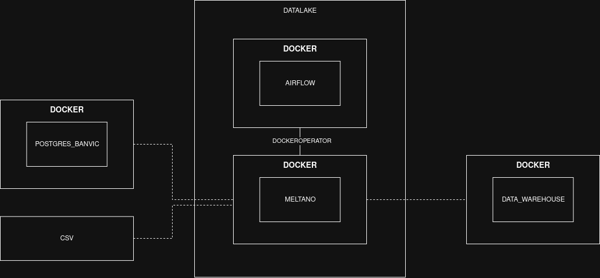

# Deploy


 
### 1. Script de inicialização
    - ./pipeline.sh

1. Cria as pastas esperadas pelo airflow com as permissões.
2. Sobe os bancos de dados
3. Constrói a imagem locais do meltano_banvic:latest para a pré-instalação dos taps e extracts meltano
   
A DAG já está configurada de forma a iniciar e terminar a execução do container meltano através do ```DockerOperator``` 

A pipeline será executada diariamente às 4:35 America/Sao_Paulo

# Anotações

## Docker-compose.yaml [airflow e meltano]

Os arquivos compose foram aproveitados das documentaçõe, seguindo instruções de deploy via containers para produção, para simular escalabilidade.

## Meltano
O meltano foi utilizado porque torna a pipeline mais robusta através dos plugins específicos para csv e banco de dados postgres.

Os plugins custom que herdam por ex. de tap-csv foram utilizados porque tornam práticio atender aos requisitos de filepath e timestamp diferente das extrações.

## Airflow
**DAG: **```airflow/dags/pipeline.py```

Há tarefas dedicadas a criar uma pasta adicional em ```meltano/extract/data/latest``` com o objetivo de servir a um "tap-datalake". 

Assim não é necessário lidar com a dinamicidade do timestamp de ```meltano/extract/data/{timestamp}}```

## Docker

Simulando ambientes separados do banvic, datalake, indicium: Há 4 dockers-compose.yml que se comunicam através da docker socket via host, unidos por rede via docker. 


1. Postgres fornecido
2. Airflow
3. Meltano
4. Postgres do datawarehouse de destino



